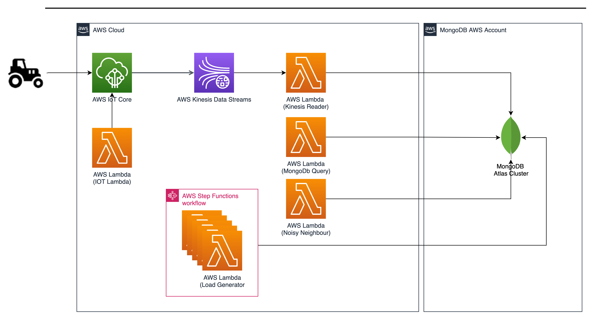

# AWS Serverless IOT Core MongoDB Integration

This cdk application deploys a demo stack showcasing integration between AWS IOT Core, AWS Kinesis, AWS Lambda and a MongoDB-Database.

Prerequisites (at least tested with)

* Node.js v18.0.0 (not higher)
* AWS cli 2.11.21 (or higher)
* cdk v2.80.0 (or higher)
* OpenSSL 1.1.1t (or higher)

Run following shell script to create a private key and associated certifcate signing request for the IOT MQTT client.

```
./00-create-certificates.sh
```

Run following shell script to Initialize the python environment and import cdk requirements. Bootstrap your account for CDK usage.

```
./01-prepare-cdk.sh
```

Run this shell script to check which resources will be deployed. Be aware of potential costs for the deployed components.

```
./02-deploy-stack.sh
```

Once you checked the deployments run this shell script to deploy them.

```
./03-deploy-stack.sh
```

After finishing your tests, do not forget to delete the stack resources to avoid unnecessary costs by running this script.

```
./04-destroy-stack.sh
```

To add additional dependencies, for example other CDK libraries, just add
them to your `requirements.txt` file and rerun the `pip install -r requirements.txt`
command.

## Useful commands

* `cdk ls`          list all stacks in the app
* `cdk synth`       emits the synthesized CloudFormation template
* `cdk deploy`      deploy this stack to your default AWS account/region
* `cdk diff`        compare deployed stack with current state
* `cdk docs`        open CDK documentation

Enjoy!
